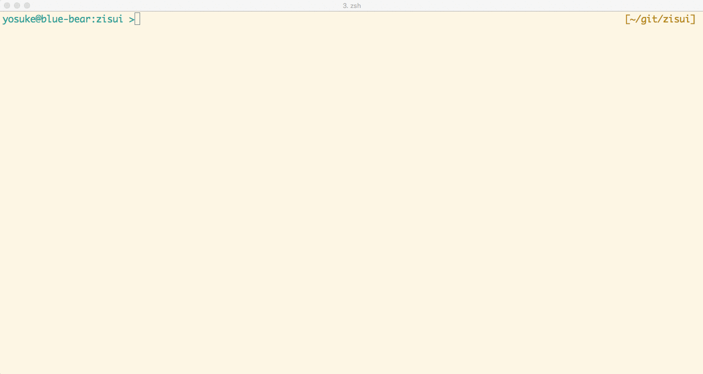

# zisui [](https://badge.fury.io/js/zisui) [](https://circleci.com/gh/Quramy/zisui) 

A fast and simple CLI to screenshot your Storybook.



## Install

```sh
$ npm install zisui
```

## How to use
*zisui* runs with 2 modes. One is "simple" and another is "managed".

With the simple mode, you don't need to configure your Storybook. Give an URL, such as:

```sh
$ zisui http://localhost:9001
```

You can launch your server via `--serverCmd` option.

```
$ zisui --serverCmd "start-storybook -p 9001" http://localhost:9001
```

Also, *zisui* can crawls built and hosted Storybook pages:

```sh
$ zisui https://release-5-0--storybooks-vue.netlify.com
```

### Managed mode
If you want to control how stories are captured (timing or size or etc...), use managed mode.

First, you need to register *zisui* Storybook addon.

```js
/* .storybook/addons.js */

import 'zisui/register';
```

Next, use `withScreenshot` decorator to tell how *zisui* captures your stories.

```js
/* .storybook/config.js */
import { addDecorator } from '@storybook/react';
import { withScreenshot } from 'zisui';

addDecorator(withScreenshot());
```

And you can overwrite the global screenshot options by decorating to specific stories.

```js
storiesOf('SomeKind', module)
.addDecorator(withScreenshot({
  viewport: {
    width: 600,
    height: 400,
  },
 }))
.add('a story', () => /* your story component */);
```

*Note*

Now, the `withScreenshot` decorator supports React only.

### CLI options

<!-- inject:clihelp -->
```txt
usage: zisui [options] storybook_url

Options:
  --help                       Show help                                                                       [boolean]
  --version                    Show version number                                                             [boolean]
  --outDir, -o                 Output directory.                                   [string] [default: "__screenshots__"]
  --parallel, -p               Number of browsers to screenshot.                                   [number] [default: 4]
  --flat, -f                   Flatten output filename.                                       [boolean] [default: false]
  --include, -i                Including stories name rule.                                        [array] [default: []]
  --exclude, -e                Excluding stories name rule.                                        [array] [default: []]
  --viewport, -V               Default viewport.                                           [string] [default: "800x600"]
  --disableCssAnimation        Disable CSS animation and transition.                           [boolean] [default: true]
  --silent                                                                                    [boolean] [default: false]
  --verbose                                                                                   [boolean] [default: false]
  --serverCmd                  Command line to launch Storybook server.                           [string] [default: ""]
  --serverTimeout              Timeout [msec] for starting Storybook server.                   [number] [default: 20000]
  --captureTimeout             Timeout [msec] for capture a story.                              [number] [default: 5000]
  --captureMaxRetryCount       Number of count to retry to capture.                                [number] [default: 3]
  --metricsWatchRetryCount     Number of count to retry until browser metrics stable.           [number] [default: 1000]
  --viewportDelay              Delay time [msec] between changing viewport and capturing.        [number] [default: 300]
  --reloadAfterChangeViewport  Whether to reload after viewport changed.                      [boolean] [default: false]

Examples:
  zisui http://localshot:9009
  zisui http://localshot:9009 -i "some-kind/a-story"
  zisui http://example.com/your-storybook -e "**/default" -V iPad
  zisui --serverCmd "start-storybook -p 3000" http://localshot:3000

```
<!-- endinject -->

### API

#### function `withScreenshot`

```typescript
withScreenshot(opt?: ScreenShotOptions): Function;
```

A Storybook decorator to notify *zisui* to screenshot stories.

#### type `ScreenShotOptions`

```
type ScreenShotOptions = {
  waitImages?: boolean,         // default true
  delay?: number,               // default 0 msec
  waitFor?: string | Function,  // default ""
  viewport?: string | {
    width: number,              // default 800
    height: number,             // default 600
  },
  fullPage?: boolean,           // default true
  skip?: boolean,               // default false
}
```

- `viewport`: If you set a string parameter, it must be included Puppeteer's device descriptors.
- `waitFor` : Sometimes you want control the timing to screenshot. If you set a function to return `Promise`, *zisui* waits the promise is resolved. Also you can set global function name to this.

```html
<!-- .storybook/preview-head.html -->
<script>
  function myWait() {
    return new Promise(res => setTimeout(res, 5000));
  }
</script>
```

```js
  withScreenshot({ waitFor: 'myWait' }) // wait for 5 seconds.
```

## Storybook version compatible
zisui is tested with the followings versions:

- Simple mode:
  - [x] Storybook v4.x
  - [x] Storybook v5.x
- Managed mode:
  - [x] Storybook v4.x
  - [x] Storybook v5.x

See also packages in `examples` directory.

## How it works?
*zisui* is a crawler using Puppeteer.

## How to contribute?
PR's are welcome :smile:

See [CONTRIBUTING](CONTRIBUTING.md) if you want more detail.

## License
MIT
